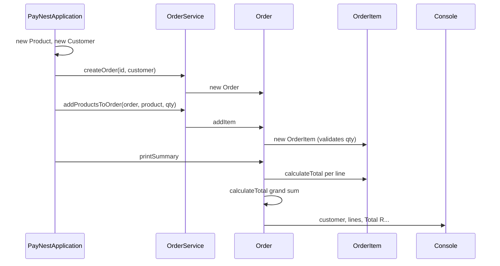

# Capstone 1 model solution — run note and design

Annotated answer key for [capstone-01-commerce-engine.md](capstone-01-commerce-engine.md). The commerce kernel lives in `domain`, `service`, and the Capstone 1 block of `PayNestApplication`.

## How to run

```bash
# Correctness (totals, validation, encapsulation)
mvn test

# CLI demo (Capstone 1 summary, then Capstone 2 payment + JDBC lesson)
mvn exec:java
```

Requires Java 21 and Maven 3.6+.

## What reviewers should see (Capstone 1 block)

Before Capstone 2 / JDBC output:

```
Order Summary
Customer: John Smith

Items:
Laptop x1 - R12000
Mouse x2 - R400

Total: R12400
```

Manual check: Laptop `12000 × 1 = 12000`, Mouse `200 × 2 = 400`, grand total `12400`.

## Flow



## Design notes (for students)

- **Why `OrderItem` exists:** an order line is product + quantity. Line subtotal is `unitPrice * quantity`; the order grand total is the sum of those lines — one definition used by both `calculateTotal()` and `printSummary()`.
- **Why catalogue is separate:** `Product` can gain fields later without rewriting checkout arithmetic.
- **Encapsulation:** `Order.getItems()` returns an unmodifiable view so callers cannot clear or inject lines outside `addItem`.
- **Quantities:** must be `> 0`; invalid adds throw `IllegalArgumentException` (fail loudly, not silently wrong totals).
- **Capstone boundary:** Capstone 1 ends at the printed summary. `Order.checkout` is Capstone 2.
