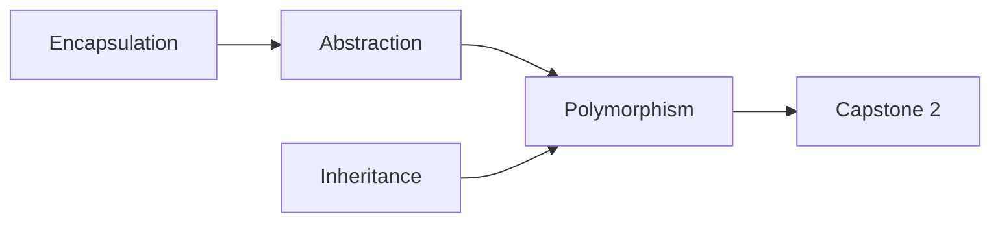
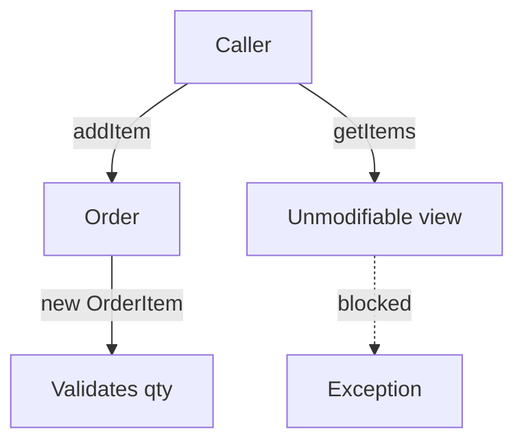
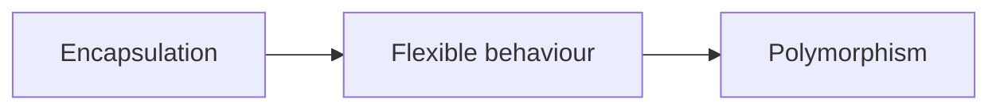
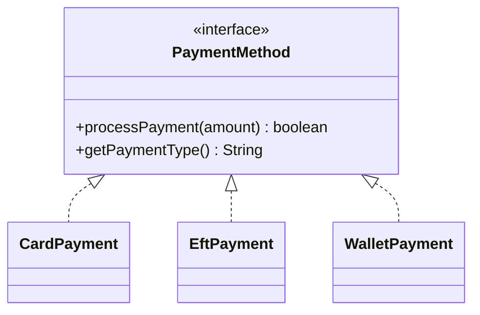
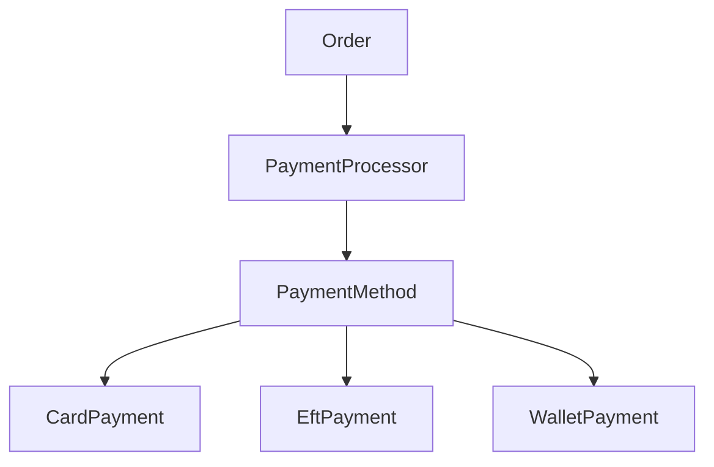
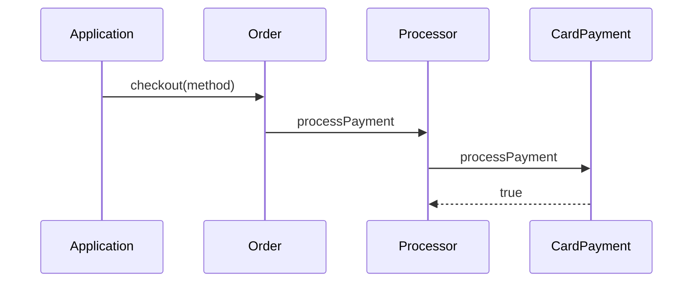
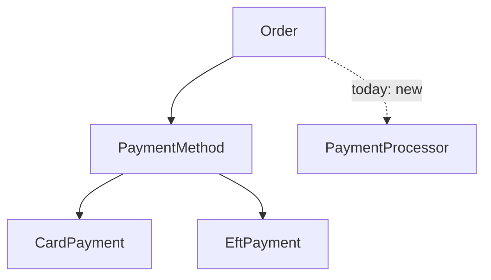
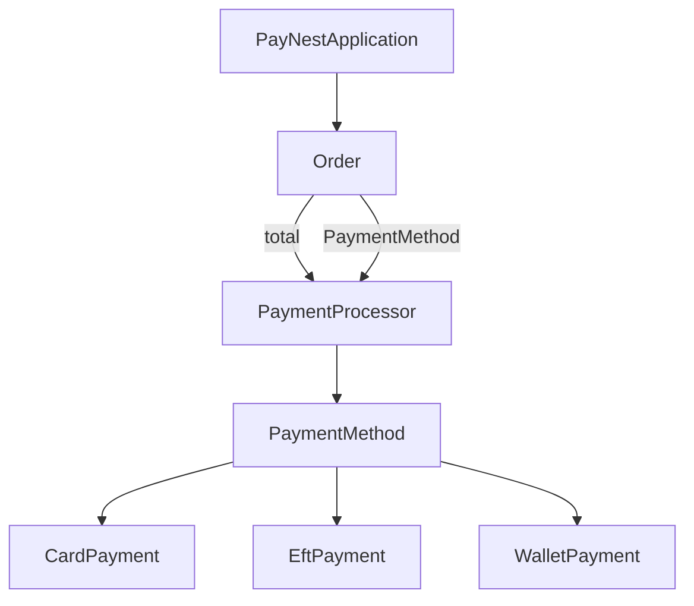

# Object-Oriented Programming Foundations

**Preparing for Capstone 2**

- PayNest checkout · interfaces · polymorphism
- Audience: beginner Java (classes, constructors, `List`)
- Goal: extend payment rails **without rewriting** order logic

**Discussion:** What broke last time when one change forced edits in three files?

---

# Learning Outcomes

Students should understand:

- The **four pillars** of OOP
- **Why** OOP exists
- **Encapsulation** (with PayNest `Order` / `Product`)
- **Polymorphism** (with `PaymentMethod`)
- How polymorphism **leads into** SOLID (OCP, DIP)

**Discussion:** Which outcome feels most unfamiliar right now?

---

# Why Object-Oriented Programming?

- **Real-world modelling** — orders, customers, payments → objects
- **Reusable code** — `calculateTotal()` written once
- **Easier maintenance** — fix line rules in `OrderItem`
- **Extensibility** — add Wallet later without rewriting arithmetic

> Nest thermostat analogy: you press “heat.” You do not rewire the furnace. Stable contract; replaceable implementation.

**Discussion:** In Capstone 1, what stayed stable when Mouse quantity became 2?

---

# The Four Pillars (Preview)

| Pillar | One-line meaning | PayNest hint |
|--------|------------------|--------------|
| **Encapsulation** | Hide internals; expose a safe API | `Order` private `items` |
| **Abstraction** | Show the essential contract | `PaymentMethod` |
| **Inheritance** | Share / specialise behaviour | Later: `BasePaymentProvider` |
| **Polymorphism** | One type, many behaviours | `checkout(PaymentMethod)` |



**Discussion:** Which pillar sounds like “a menu every rail must support”?

---

# Encapsulation — What Is It?

Bundling **data + behaviour**, and **controlling access**.

- Fields hold state (`price`, `items`, `quantity`)
- Methods define allowed operations (`addItem`, `calculateTotal`)
- Callers use the **public API**, not the raw guts

```java
public class Product {
    private final int id;
    private final String name;
    private final double price;   // hidden

    public double getPrice() { return price; }
}
```

**Why should we care?** So nobody sets `price = -999` mid-checkout.

**Discussion:** Should a receipt printer change `Product.price`?

---

# Why `private` Fields Exist

`private` = **only this class** may touch the field directly.

```java
// Order.java
private final int id;
private final Customer customer;
private final List<OrderItem> items;  // owned here
```

- Callers **cannot** `order.items.clear()`
- They must use `addItem(product, quantity)`
- Totals stay trustworthy — **one** mutation path

**Why should we care?** Broken totals = angry merchants and failed demos.

**Discussion:** What goes wrong if `items` is `public`?

---

# BAD Encapsulation

**Fake anti-pattern** (not in PayNest — on purpose):

```java
public class BadOrder {
    public List<OrderItem> items = new ArrayList<>();
    public double total;   // anyone can set this!

    public void printSummary() {
        System.out.println("Total: R" + total); // may lie
    }
}
```

- Caller can `items.clear()` after totals were shown
- Caller can set `total = 0` without paying
- **No single source of truth**

**Why should we care?** Bugs hide in “someone else mutated my fields.”

**Discussion:** Worse: a wrong total, or a total that *looks* right but was hand-edited?

---

# GOOD Encapsulation (PayNest `Order`)

```java
public void addItem(Product product, int quantity) {
    OrderItem orderItem = new OrderItem(product, quantity);
    items.add(orderItem);
}

public List<OrderItem> getItems() {
    return Collections.unmodifiableList(items);
}

public double calculateTotal() { /* sum line totals */ }
```

- Mutation only through `addItem`
- Read-only view outward
- Total **computed** — never a free-floating field

**Why should we care?** Payment must charge this exact grand total.

**Discussion:** Why `unmodifiableList` instead of the raw `ArrayList`?

---

# Quiz — Encapsulation

1. Why are `Product` fields `private final`?
2. What happens if a caller `add()`s to `order.getItems()`?
3. Where is quantity validated — `Order` or `OrderItem`?
4. True/False: Getters always break encapsulation.



**Discussion:** Encapsulation = “never share data,” or “share it safely”?

---

# Transition — Protection → Behaviour

Encapsulation protects an object’s **state**.

Capstone 2 asks something new:

> How do **Card**, **EFT**, and **Wallet** behave differently  
> while checkout stays **one reusable path**?



We need a **contract** every rail obeys — then swap the rail.

**Discussion:** If you wrote `if (type.equals("CARD"))…`, what happens when BNPL arrives?

---

# Polymorphism — Definition

**Polymorphism** = *many forms*.

- **One interface** (shared contract)
- **Many implementations** (different behaviour)
- Callers program against the **contract**, not the concrete class

```java
PaymentMethod paymentMethod = new CardPayment();
order.checkout(paymentMethod);
```

Same `checkout` works for `EftPayment` or `WalletPayment`.

**Discussion:** What type is the *variable*? What type is the *object*?

---

# Compile-Time vs Runtime

| Kind | When decided | Capstone 2? |
|------|--------------|-------------|
| **Compile-time** | Before run (e.g. overloading) | Rarely the focus |
| **Runtime** | During run (interface / override) | **This is Capstone 2** |

```java
method.processPayment(amount);
// Compiler: method is a PaymentMethod
// JVM: picks Card / EFT / Wallet override
```

**Discussion:** If the variable is `PaymentMethod`, how does Java print `"CARD"`?

---

# Interfaces — The Contract

An **interface** lists methods a class **must** provide.

```java
// com.paynestsystem.payment.PaymentMethod
public interface PaymentMethod {
    boolean processPayment(double amount);
    String getPaymentType();
}
```

- Abstraction: “process this Rand amount; name your rail”
- Small on purpose — easy to implement
- Checkout depends on **this**, not Card/EFT/Wallet

**Discussion:** Why two methods instead of one mega-method?

---

# Implementations — Many Forms

```java
public class CardPayment implements PaymentMethod {
    @Override
    public boolean processPayment(double amount) {
        return true; // simulated
    }
    @Override
    public String getPaymentType() {
        return "CARD";
    }
}
```

Same shape: `EftPayment` (`"EFT"`), `WalletPayment` (`"WALLET"`).



**Discussion:** Related by `extends`? Why or why not?

---

# Dynamic Dispatch

JVM chooses the override **at runtime**.

```java
// PaymentProcessor.java
public void processPayment(PaymentMethod method, double amount) {
    boolean success = method.processPayment(amount);
    if (success) {
        System.out.println("Payment successful via "
            + method.getPaymentType());
    }
}
```

- Never mentions `CardPayment`
- Swap the object → swap the behaviour

**Discussion:** Where would an if/else anti-pattern have lived instead?

---

# Why Checkout Only Needs `PaymentMethod`

```java
public void checkout(PaymentMethod paymentMethod) {
    double total = calculateTotal();
    PaymentProcessor processor = new PaymentProcessor();
    processor.processPayment(paymentMethod, total);
}
```



- Order owns **how much** · Rail owns **how**

**Discussion:** What changes when we add `BuyNowPayLaterPayment`?

---

# Polymorphism in Action

```java
// PayNestApplication — Capstone 2 block
PaymentMethod paymentMethod = new CardPayment();
order.checkout(paymentMethod);
```

| Construction | Type label | Checkout edits? |
|--------------|------------|-----------------|
| `new CardPayment()` | `CARD` | No |
| `new EftPayment()` | `EFT` | No |
| `new WalletPayment()` | `WALLET` | No |

**Design intent:** same order total; only the rail changes.

**Discussion:** Is polymorphism in the *construction* line or the *checkout* line?

---

# Quick Check — Polymorphism

1. What keyword links `CardPayment` to `PaymentMethod`?
2. Can `PaymentProcessor` compile if `CryptoPayment` does not exist yet?
3. True/False: Polymorphism requires `extends`.
4. Name the runtime mechanism that picks the override.



**Discussion:** Why is “False” on Q3 important for Capstone 2?

---

# Mechanism vs Design Principle

| | **Mechanism** | **Design principle** |
|--|---------------|----------------------|
| What | Language feature | Guidance for structure |
| Example | Polymorphism, interfaces | SOLID (OCP, DIP, …) |
| Role | *How* behaviour varies | *How* to organise modules |

> **Polymorphism is NOT a SOLID principle.**  
> It is the **mechanism** that enables several SOLID principles.

**Discussion:** Can you follow OCP without polymorphism? How painful?

---

# Open/Closed Principle (OCP)

**Open** for extension · **Closed** for modification

- Add `BuyNowPayLaterPayment` → **new class**
- Do **not** rewrite `calculateTotal()` or processor logic

```mermaid
flowchart LR
  subgraph closed [Closed]
    Order
    PaymentProcessor
  end
  subgraph open [Open]
    BNPL[BuyNowPayLaterPayment]
    Card[CardPayment]
  end
  PaymentMethod <|.. BNPL
  PaymentMethod <|.. Card
  Order --> PaymentMethod
```

Polymorphism is how OCP becomes real in Java.

**Discussion:** Which files *must* change for BNPL? Which *must not*?

---

# Dependency Inversion (DIP Preview)

**Depend on abstractions, not concretions.**

```java
// Good — Capstone 2
public void checkout(PaymentMethod paymentMethod) { ... }

// Weaker — honest look at PayNest today
PaymentProcessor processor = new PaymentProcessor();
```



**Discussion:** Why depend on `PaymentMethod` instead of `CardPayment`?

---

# Polymorphism Enables SOLID

```mermaid
mindmap
  root((Polymorphism))
  OCP[Open/Closed]
  DIP[Dependency Inversion]
  LSP[Liskov Substitution]
  SRP[Order totals vs rail details]
```

- Polymorphism ≠ SOLID
- Without it, OCP/DIP become if/else forests
- Capstone 2 grades architecture & polymorphism heavily (**25%**)

**Discussion:** Which SOLID letter matches “add a rail without rewriting order logic”?

---

# Capstone 2 Architecture



- **Order** — lines, totals, starts checkout
- **PaymentProcessor** — talks to any rail
- **PaymentMethod** — the contract
- **Card / EFT / Wallet** — concrete rails

**Discussion:** Where does the charged amount come from — rail or order?

---

# Extending Without Rewriting

> New rail = **new class + wiring**,  
> not editing Order’s core arithmetic.

BNPL checklist:

1. `BuyNowPayLaterPayment implements PaymentMethod`
2. Wire in `PayNestApplication` (or a test)
3. Leave `calculateTotal()` alone
4. Leave `PaymentProcessor` alone (if it only uses the interface)

**That** is OCP powered by polymorphism.

**Discussion:** Would a giant `switch (type)` inside Order pass distinction?

---

# What You Should Remember

1. **Encapsulation** protects totals (`private`, `addItem`, unmodifiable views)
2. **Interfaces** define payment contracts without payment details
3. **Polymorphism** keeps checkout stable while rails vary
4. **OCP / DIP** = design goals; polymorphism = Java mechanism
5. Success test: *new rail, minimal edits*

> Same order total everywhere; only the payment rail changes.

**Discussion:** Explain Capstone 2 in one sentence to a classmate who missed today.

---

# Appendix A — Live Coding Plan (20 min)

| Min | Activity | File(s) |
|-----|----------|---------|
| 0–3 | Run C1 summary + C2 checkout | `PayNestApplication` |
| 3–7 | Break encapsulation (`getItems().add`) | `Order` |
| 7–11 | if/else anti-pattern (scratch only) | *(do not commit)* |
| 11–15 | `PaymentMethod` + three rails | `payment/*` |
| 15–18 | Swap Card → EFT | `PayNestApplication` |
| 18–20 | Sketch BNPL; list files touched | whiteboard |

**Goal:** feel that checkout did **not** change when the rail did.

---

# Appendix B — Student Exercises

1. **Trace** the call stack from `main` to `CardPayment.processPayment`.
2. **Predict** the exception from `order.getItems().clear()`.
3. List three if/else payment designs and why each fails OCP.
4. **Pair:** add a console line in each rail naming rail + amount.
5. **Test sketch:** JUnit outline for two rails’ `getPaymentType()`.

---

# Appendix C — Common Misconceptions

| Misconception | Reality |
|---------------|---------|
| Interfaces are “enterprise only” | Capstone 2 is 1 interface + 3 small classes |
| Polymorphism requires `extends` | `implements` is enough — preferred here |
| Getters break encapsulation | Uncontrolled *mutation* breaks it |
| Polymorphism is a SOLID principle | It is a **mechanism**; SOLID are **principles** |
| Order should know card fees | Rails own rail details; Order owns totals |
| BNPL means editing `PaymentProcessor` | Only if you hard-coded card logic |

---

# Appendix D — Quiz Questions

1. Quote the two methods on `PaymentMethod`.
2. Why does `Order.getItems()` use `unmodifiableList`?
3. In `PaymentMethod m = new WalletPayment();` — variable type? object type?
4. Dynamic dispatch in one sentence (`PaymentProcessor`).
5. One OCP-friendly change and one OCP-breaking change for a new rail.
6. Is `new PaymentProcessor()` inside `Order` ideal DIP? Why/why not?
7. Capstone rubric question about BNPL — what do reviewers ask?

---

# Appendix E — Homework (before Capstone 2)

1. Read `docs/assessments/capstone-02-payment-methods.md` end-to-end.
2. Draw: `PaymentMethod` ← Card / EFT / Wallet.
3. One paragraph: *why interfaces beat a mega-method* (matches deliverable).
4. Run `mvn test` and `mvn exec:java`; note the payment lines.
5. Stretch: draft `BuyNowPayLaterPayment` locally.
6. Stretch: sketch a test that checkouts with two different rails.

**Bring:** diagram + “files changed for BNPL” list.

---

# References (PayNest source)

| Topic | Path |
|-------|------|
| Demo wiring | `.../app/PayNestApplication.java` |
| Encapsulation | `.../domain/Order.java`, `OrderItem`, `Product` |
| Contract | `.../payment/PaymentMethod.java` |
| Rails | `CardPayment`, `EftPayment`, `WalletPayment` |
| Orchestration | `.../payment/PaymentProcessor.java` |
| Brief | `docs/assessments/capstone-02-payment-methods.md` |
| SE live session | `docs/live-sessions/capstone-02-design-to-interfaces/` |
